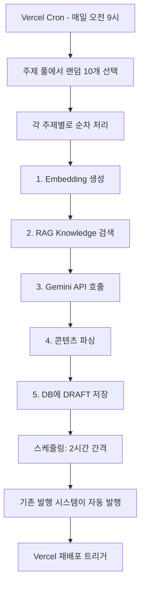

# 매일 자동 블로그 포스트 생성 시스템

## 📌 개요

매일 오전 9시에 자동으로 10개의 블로그 포스트를 생성하는 시스템입니다.

- **주제 풀**: 110개의 Colemearchy 페르소나 맞춤 주제
- **자동 스케줄링**: 2시간 간격으로 예약 발행
- **RAG 시스템**: 과거 knowledge base 활용
- **페르소나 준수**: PM/디자이너 관점 (개발자 코스프레 금지)

## 🏗️ 시스템 구조

```
scripts/
├── blog-topics-pool.ts          # 110개 주제 풀
├── generate-daily-posts.ts      # 메인 생성 스크립트
├── check-latest-posts.ts        # 검증 스크립트
└── check-draft-posts.ts         # DRAFT 포스트 확인

src/app/api/cron/
└── generate-daily-posts/
    └── route.ts                 # Vercel Cron Job 엔드포인트

vercel.json                      # Cron 스케줄 설정 (매일 오전 9시)
```

## 📋 주제 카테고리

| 카테고리 | 개수 | 예시 |
|---------|------|------|
| **PM & 제품 관리** | 25개 | A/B 테스트, PRD 작성, OKR 등 |
| **디자이너 & UX/UI** | 15개 | 피그마, 디자인 시스템, 포트폴리오 |
| **바이오해킹 & 건강** | 20개 | 간헐적 단식, Wegovy, 명상 앱 |
| **AI 도구 & 자동화** | 15개 | Claude Code, Notion AI, Cursor |
| **스타트업 & 성장** | 15개 | Y Combinator, PMF, MVP 검증 |
| **투자 & 재테크** | 10개 | ETF, FIRE, 배당주 |
| **개인 개발 & 철학** | 10개 | Second Brain, 미니멀리즘 |

**총 110개 주제**

## 🚀 사용 방법

### 1. 로컬 테스트 (DRY_RUN 모드)

실제 DB에 저장하지 않고 테스트:

```bash
# 3개 포스트 테스트
DRY_RUN=true POSTS_PER_DAY=3 pnpm tsx scripts/generate-daily-posts.ts

# 10개 포스트 테스트 (기본값)
DRY_RUN=true pnpm tsx scripts/generate-daily-posts.ts
```

### 2. 실제 생성 (로컬)

```bash
# 3개 실제 생성
POSTS_PER_DAY=3 pnpm tsx scripts/generate-daily-posts.ts

# 10개 실제 생성 (기본값)
pnpm tsx scripts/generate-daily-posts.ts
```

### 3. 생성된 포스트 확인

```bash
# 최근 1시간 내 생성된 DRAFT 포스트 확인
pnpm tsx scripts/check-latest-posts.ts

# 전체 DRAFT 포스트 15개 확인
pnpm tsx scripts/check-draft-posts.ts
```

### 4. Vercel Cron Job (자동)

배포 후 매일 오전 9시(KST)에 자동 실행됩니다.

**설정 위치**: `vercel.json`
```json
{
  "crons": [
    {
      "path": "/api/cron/generate-daily-posts",
      "schedule": "0 9 * * *"  // 매일 오전 9시 UTC (KST 오후 6시)
    }
  ]
}
```

**⚠️ 주의**: `0 9 * * *`는 UTC 시간입니다. KST 오전 9시로 하려면 `0 0 * * *` (UTC 0시 = KST 9시)로 변경하세요.

## ⚙️ 환경 변수

### 필수 환경 변수

```bash
GEMINI_API_KEY=your-api-key          # Gemini API 키
CRON_SECRET=your-secret-key          # Cron 작업 인증
DATABASE_URL=your-database-url       # PostgreSQL 연결
```

### 선택적 환경 변수

```bash
POSTS_PER_DAY=10                     # 하루에 생성할 포스트 수 (기본값: 10)
HOURS_BETWEEN_POSTS=2                # 포스트 간격 시간 (기본값: 2시간)
DRY_RUN=true                         # 테스트 모드 (기본값: false)
```

## 🔧 수동 실행 (API)

### GET 요청 - 설정 확인

```bash
curl -H "Authorization: Bearer YOUR_CRON_SECRET" \
  https://colemearchy.com/api/cron/generate-daily-posts
```

**응답 예시**:
```json
{
  "message": "Daily post generation endpoint is ready",
  "config": {
    "postsPerDay": "10",
    "hoursBetweenPosts": "2",
    "dryRun": false
  },
  "timestamp": "2025-10-21T07:16:16.000Z"
}
```

### POST 요청 - 수동 실행

```bash
curl -X POST -H "Authorization: Bearer YOUR_CRON_SECRET" \
  https://colemearchy.com/api/cron/generate-daily-posts
```

**응답 예시**:
```json
{
  "success": true,
  "message": "Generated 10 posts successfully",
  "stats": {
    "successful": 10,
    "failed": 0,
    "dryRun": false,
    "durationSeconds": 95.42
  },
  "timestamp": "2025-10-21T07:20:00.000Z"
}
```

## 📊 작동 흐름



## 🎯 생성된 포스트 특징

### ✅ 페르소나 준수

- **나는**: 디자이너 출신 6년차 PM
- **회사**: AI 스타트업
- **금지 표현**: "개발자로서", "코드를 짰어요"
- **권장 표현**: "PM으로서", "AI 도구로", "디자이너 출신으로"

### ✅ RAG 시스템 활용

- 과거 knowledge base에서 유사 콘텐츠 검색
- 개인적 스타일과 생각 반영
- 일관성 있는 톤앤매너

### ✅ 스케줄링

- 생성 시점부터 2시간 간격으로 예약
- 예시: 오전 9시 생성 → 11시, 13시, 15시... 예약 발행
- 기존 `/api/publish-posts` cron이 자동 발행

## 🛠️ 주제 풀 관리

### 새로운 주제 추가

`scripts/blog-topics-pool.ts` 파일 수정:

```typescript
export const BLOG_TOPICS_POOL: BlogTopic[] = [
  // ... 기존 주제들 ...
  {
    prompt: "새로운 주제 제목과 설명",
    keywords: ["키워드1", "키워드2", "키워드3"],
    category: "PM" // 또는 "디자이너", "바이오해킹" 등
  }
];
```

### 카테고리별 생성

현재는 랜덤 선택이지만, 필요시 카테고리별 생성도 가능:

```typescript
import { getTopicsByCategory } from './blog-topics-pool';

// PM 주제만 5개 선택
const pmTopics = getTopicsByCategory('PM', 5);
```

## 🔍 모니터링

### 로그 확인 (Vercel)

1. Vercel Dashboard → 프로젝트 선택
2. Logs 탭
3. 필터: `/api/cron/generate-daily-posts`

### 생성 결과 확인

```bash
# 최근 생성된 포스트
pnpm tsx scripts/check-latest-posts.ts

# 예약된 DRAFT 포스트 전체
pnpm tsx scripts/check-draft-posts.ts
```

### 실패 처리

- 개별 포스트 실패 시: 에러 로그 기록 후 계속 진행
- 전체 실패 시: HTTP 500 응답, Vercel 알림

## ⚠️ 주의사항

### 1. Gemini API 할당량

- 110개 주제 중 랜덤 선택이므로 중복 가능성 낮음
- 하루 10개 = 월 300개 포스트
- API 할당량 모니터링 필요

### 2. 실행 시간

- 10개 생성 시 약 1.5~2분 소요
- Vercel 함수 타임아웃: 5분 (Pro 플랜)
- 포스트 수 조정 시 타임아웃 주의

### 3. 데이터베이스

- DRAFT 포스트가 계속 쌓임
- 주기적으로 발행되지 않은 오래된 DRAFT 정리 권장

## 📈 확장 아이디어

### 1. 카테고리별 균형 생성

```typescript
// PM 4개 + 디자이너 2개 + 바이오해킹 2개 + AI 도구 2개
const pmTopics = getTopicsByCategory('PM', 4);
const designTopics = getTopicsByCategory('디자이너', 2);
// ...
```

### 2. 트렌드 기반 주제 선택

- 키워드 검색량 API 연동
- 인기 주제 우선 선택

### 3. 다국어 동시 생성

- 한국어 생성 후 즉시 영어 번역
- `translations` 테이블에 저장

### 4. 이미지 자동 생성

- Midjourney API 또는 DALL-E 연동
- `coverImage` 필드 자동 채우기

## 🐛 트러블슈팅

### Q: Embedding API 에러 발생 시?

**A**: RAG 없이 계속 진행됩니다.

```
⚠️ Embedding generation failed, continuing without RAG
```

### Q: 포스트가 발행되지 않음?

**A**:
1. `scheduledAt` 시간 확인: `pnpm tsx scripts/check-draft-posts.ts`
2. `/api/publish-posts` cron이 정상 작동하는지 확인
3. 수동 발행: `curl -X POST -H "Authorization: Bearer $CRON_SECRET" https://colemearchy.com/api/publish-posts`

### Q: 같은 주제가 반복 생성됨?

**A**: 주제 풀 110개에서 랜덤 선택이므로 확률적으로 가능. 필요 시 생성 이력 추적 기능 추가.

## 📝 변경 이력

- **2025-10-21**: 초기 시스템 구축
  - 110개 주제 풀 생성
  - Vercel Cron Job 연동
  - DRY_RUN 모드 지원
  - RAG 시스템 통합

---

**작성자**: Claude Code
**최종 업데이트**: 2025-10-21
